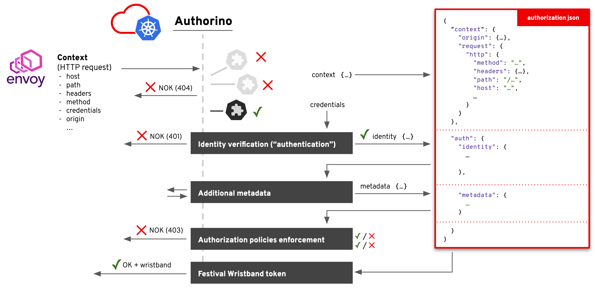

# Authorino architecture and Feature description
- [Architecture](#architecture)
  - [Protecting upstream APIs with Envoy and Authorino](#protecting-upstream-apis-with-envoy-and-authorino)
  - [The Authorino `AuthConfig` Custom Resource Definition (CRD)](#the-authorino-authconfig-custom-resource-definition-crd)
  - [The "Auth Pipeline"](#the-auth-pipeline)
  - [The Authorization JSON](#the-authorization-json)
- [Feature description](#feature-description)
  - [API key authentication](#api-key-authentication)
  - [Kubernetes authentication](#kubernetes-authentication)
  - [OpenID Connect (OIDC) JWT verification and validation](#openid-connect-oidc-jwt-verification-and-validation)
  - [OAuth 2.0 (token introspection)](#oauth-20-token-introspection)
  - [Festival Wristband authentication](#festival-wristband-authentication)
  - [Mutual Transport Layer Security (mTLS) authentication](#mutual-transport-layer-security-mtls-authentication)
  - [Hash Message Authentication Code (HMAC) authentication](#hash-message-authentication-code-hmac-authentication)
  - [OpenID Connect (OIDC) User Info](#openid-connect-oidc-user-info)
  - [User-Managed Access (UMA) resource data](#user-managed-access-uma-resource-data)
  - [External HTTP authorization metadata](#external-http-authorization-metadata)
  - [JSON pattern-matching authorization](#json-pattern-matching-authorization)
  - [Open Policy Agent (OPA) Rego policies](#open-policy-agent-opa-rego-policies)
  - [Kubernetes authorization](#kubernetes-authorization)
  - [Festival Wristbands](#festival-wristbands)
  - [Dynamic JSON response](#dynamic-json-response)

## Architecture

### Protecting upstream APIs with Envoy and Authorino

Typically, upstream APIs are deployed to the same Kubernetes cluster and namespace where the Envoy proxy and Authorino is running (although not necessarily). Whatever is the case, Envoy proxy must be serving the upstream API (see Envoy's [HTTP route components](https://www.envoyproxy.io/docs/envoy/latest/api-v3/config/route/v3/route_components.proto) and virtual hosts) and pointing to Authorino in the external authorization filter.

An `Ingress` resource exposing Envoy service on a host name that must resolves to the Kubernetes cluster and identifies the API for external users. This host name is important as well for Authorino as it goes in the Authorino `AuthConfig` custom resource that declares the protection to the API.

You must then be ready to write and apply the custom resource that describes the desired state of the protection for the API.

There is no need to redeploy neither Authorino nor Envoy after applying a protection config. Authorino controller will automatically detect any changes relative to `authorino.3scale.net`/`AuthConfig` resources and reconcile them inside the running instances.

### The Authorino `AuthConfig` Custom Resource Definition (CRD)

Each API protection is declared in the form a [Kubernetes Custom Resource](https://kubernetes.io/docs/concepts/extend-kubernetes/api-extension/custom-resources).

Please check out the [spec](/install/crd/authorino.3scale.net_authconfigs.yaml) of Authorino's `AuthConfig` custom resource for the details of how to configure **identity** verification, external authorization **metadata**, **authorization** policies and optional **wristband** token issuing on requests to you API.

A typical Authorino's `AuthConfig` custom resource looks like the following:

```yaml
apiVersion: authorino.3scale.net/v1beta1
kind: AuthConfig
metadata:
  name: my-api-protection
spec:
  hosts:
    - my-api.io # used for lookup

  # List of identity sources - at least one must accept the supplied token or credential
  identity:
    - name: my-idp-users
      oidc: # the authentication protocol (supported: oidc, oauth2, kubernetes, apiKey, mtls, hmac)
        issuer: https://my-idp/realm
      credentials: # where the access token of credential must travel in the request
        in: authorization_header
        keySelector: Bearer

    - name: api-key-users
      apiKey:
        labelSelectors:
          authorino.3scale.net/managed-by: authorino
      credentials:
        in: authorization_header
        keySelector: APIKEY

  # List of external sources of authorization metadata (if you need any)
  metadata:
    - name: online-userinfo
      userInfo: # the external metadata protocol (supported: userInfo, uma, http)
        identitySource: my-idp-users

    - name: external-resource-data
      http:
        endpoint: https://some-external-service/resource-data?id={context.request.http.path}
        method: POST
        sharedSecretRef:
          name: authorino-secrets
          key: auth-key-for-authorino-on-the-external-service
        credentials:
          in: authorization_header
          keySelector: Bearer

  # List of authorization policies – all policies must grant access
  authorization:
    - name: my-rbac-policy
      json: # the authorization policy format (supported: json, opa)
        conditions: # allows to skip this policy if the conditions do not match
          - selector: auth.identity.roles # fetched from the authorization JSON
            operator: excl # supported operator: eq, neq, incl, excl, matches
            value: admin
        rules: # the actual set of rules that must match when this policy is evaluates
          - selector: auth.content.request.method
            operator: eq
            value: GET

    - name: my-opa-policy
      opa:
        inlineRego: |
          allow { true }

  # List of response configs – all items are evaluated and supplied back to the external authorization client
  response:
    - name: my-custom-dynamic-response-data
      json: # the response builder type (supported: json, wristband)
        properties:
          - name: prop1
            value: value1
      wrapper: envoyDynamicMetadata

    - name: my-wristband
      wristband:
        issuer: https://authorino-oidc.authorino.svc.cluster.local:8083/namespace/my-api-protection/my-wristband
        customClaims:
          - name: foo
            value: bar
          - name: exp
            valueFrom:
              authJSON: auth.identity.exp
        signingKeyRefs:
          - name: my-signing-key
            algorithm: ES256
      wrapper: httpHeader
      wrapperKey: x-ext-auth-wristband
```

More concrete examples focused on each individual supported feature can be found at the [Examples page](/examples).

### The "Auth Pipeline"



In each request to the protected API, Authorino triggers the so-called "Auth Pipeline", a set of configured *evaluators* that are organized in a 4-phase pipeline:

- **(i) Identity phase:** at least one source of identity (i.e., one identity evaluator) must resolve the supplied credential in the request into a valid identity or Authorino will otherwise reject the request as unauthenticated (401 HTTP response status).
- **(ii) Metadata phase:** optional fetching of additional data from external sources, to add up to context and identity information, and used in authorization policies and wristband claims (phases iii and iv).
- **(iii) Authorization phase:** all unskipped policies must evaluate to a positive result ("authorized"), or Authorino will otherwise reject the request as unauthorized (403 HTTP response code).
- **(iv) Response phase** – Authorino builds all user-defined response items (dynamic JSON objects and/or _Festival Wristband_ OIDC tokens), which are supplied back to the external authorization client within added HTTP headers or as Envoy Dynamic Metadata

Each phase is sequential to the other, from (i) to (iv), while the evaluators within each phase are triggered concurrently. The **Identity** phase (i) is the only one required to list at least one evaluator (i.e. one identity source or more); **Metadata**, **Authorization** and **Response** phases can have any number of evaluators (including zero, and even be omitted in this case).

### The Authorization JSON

Along the auth pipeline, Authorino builds the *authorization payload*, a JSON content composed of *context* information about the request, as provided by the proxy to Authorino, plus *auth* objects resolved and collected along of phases (i) and (ii). In each phase, the authorization JSON can be accessed by the evaluators, leading to phase (iii) counting with a payload (input) that looks like the following:

```jsonc
// The authorization JSON combined along Authorino's auth pipeline for each request
{
  "context": { // the input from the proxy
    "origin": {…},
    "request": {
      "http": {
        "method": "…",
        "headers": {…},
        "path": "/…",
        "host": "…",
        …
      }
    }
  },
  "auth": {
    "identity": {
      // the identity resolved, from the supplied credentials, by one of the evaluators of phase (i)
    },
    "metadata": {
      // each metadata object/collection resolved by the evaluators of phase (ii), by name of the evaluator
    }
  }
}
```

The policies evaluated in phase (iii) can use any data from the authorization JSON to define authorization rules.

After phase (iii), Authorino appends to the authorization JSON the results of this phase as well, and the input available for phase (iv) becomes:

```jsonc
// The authorization JSON combined along Authorino's auth pipeline for each request
{
  "context": { // the input from the proxy
    "origin": {…},
    "request": {
      "http": {
        "method": "…",
        "headers": {…},
        "path": "/…",
        "host": "…",
        …
      }
    }
  },
  "auth": {
    "identity": {
      // the identity resolved, from the supplied credentials, by one of the evaluators of phase (i)
    },
    "metadata": {
      // each metadata object/collection resolved by the evaluators of phase (ii), by name of the evaluator
    },
    "authorization": {
      // each authorization policy result resolved by the evaluators of phase (iii), by name of the evaluator
    }
  }
}
```

[Festival Wristbands](#festival-wristbands) can include custom claims fetching values from the authorization JSON, as well as properties of [Dynamic JSON](#dynamic-json-response) responses. These can be returned to the external authorization client in added HTTP headers or as Envoy [Well Known Dynamic Metadata](https://www.envoyproxy.io/docs/envoy/latest/configuration/advanced/well_known_dynamic_metadata).

## Feature description

This section is not an exhaustive list of features of Authorino. Rather, it describes some of Authorino's most used features, providing, in some cases, details of the implementation of these in Authorino. that can help understand how they work and to use them.

For an updated list of all features and current state of development of each feature, please refer to the [List of features](/README.md#list-of-features) in the main page of the repo.

### API key authentication

Authorino relies on Kubernetes `Secret` resources to represent API keys. To define an API key, create a `Secret` in the cluster containing an `api_key` entry that holds the value of the API key. The resource must be labeled with the `spec.identity.apiKey.labelSelectors` listed in the Authorino `AuthConfig` custom resource. For example:

For the following custom resource:

```yaml
apiVersion: authorino.3scale.net/v1beta1
kind: AuthConfig
metadata:
  name: my-api-protection
spec:
  hosts:
    - my-api.io
  identity:
    - name: api-key-users
      apiKey:
        labelSelectors: # the key-value set used to select the matching `Secret`s; resources including these labels will be acepted as valid API keys to authenticate to this service
          group: friends # some custom label
```

The following secret would represent a valid API key:

```yaml
apiVersion: v1
kind: Secret
metadata:
  name: user-1-api-key-1
  labels:
    authorino.3scale.net/managed-by: authorino # required, so the Authorino controller reconciles events related to this secret
    group: friends
stringData:
  api_key: <some-randomly-generated-api-key-value>
type: Opaque
```

The resolved identity object, added to the authorization JSON following an API key identity source evaluation, is the Kubernetes `Secret` resource (as JSON).

### Kubernetes authentication

Authorino can verify Kubernetes-valid access tokens (using Kubernetes [TokenReview API](https://kubernetes.io/docs/reference/kubernetes-api/authentication-resources/token-review-v1/)).

These tokens can be either `ServiceAccount` tokens such as the ones issued by kubelet as part of Kubernetes [Service Account Token Volume Projection](https://kubernetes.io/docs/tasks/configure-pod-container/configure-service-account/#service-account-token-volume-projection), or any valid user access tokens issued to users of the Kubernetes server API.

The list of `audiences` of the token must include the requested host of the protected API (default), or all the audiences specified in the Authorino `AuthConfig` custom resource. For example:

For the following custom resource, the Kubernetes token must include the audience **my-api.io**:

```yaml
apiVersion: authorino.3scale.net/v1beta1
kind: AuthConfig
metadata:
  name: my-api-protection
spec:
  hosts:
    - my-api.io
  identity:
    - name: cluster-users
      kubernetes: {}
```

Whereas for the following custom resource, the Kubernetes token audiences must include **foo** and **bar**:

```yaml
apiVersion: authorino.3scale.net/v1beta1
kind: AuthConfig
metadata:
  name: my-api-protection
spec:
  hosts:
    - my-api.io
  identity:
    - name: cluster-users
      kubernetes:
        audiences:
          - foo
          - bar
```

The resolved identity object, added to the authorization JSON following a Kubernetes authentication identity source evaluation, is the decoded JWT when the Kubernetes token is a valid JWT, or the value of `status.user` in the response to the TokenReview request (see Kubernetes [UserInfo](https://kubernetes.io/docs/reference/generated/kubernetes-api/v1.19/#userinfo-v1-authentication-k8s-io) for details).

### OpenID Connect (OIDC) JWT verification and validation

Authorino automatically discovers OpenID Connect configurations for the configured issuers and verifies JSON Web Tokens (JWTs) supplied on each request.

Authorino also fetches the JSON Web Key Sets (JWKS) used to verify the JWTs, matching the `kid` stated in the JWT header (i.e., support to key rotation).


The decoded JWTs (and fetched user info) are appended to the authorization JSON as the resolved identity.

### OAuth 2.0 (token introspection)

For bare OAuth 2.0 implementations, Authorino can perform token introspection on the access tokens supplied in the requests to protected APIs.

Authorino does not implement any of OAuth 2.0 grants for the applications to obtain the token. However, it can verify supplied tokens with the OAuth server, including opaque tokens, as long as the server exposes the `token_introspect` endpoint ([RFC 7662](https://tools.ietf.org/html/rfc7662)).

Developers must set the token introspection endpoint in the [CR spec](#the-authorino-service-authconfig-resource-definition-crd), as well as a reference to the Kubernetes secret storing the credentials of the OAuth client to be used by Authorino when requesting the introspect.


The response returned by the OAuth2 server to the token introspection request is the the resolved identity appended to the authorization JSON.

### Festival Wristband authentication

Authorino-issued [Festival Wristband](#festival-wristbands) tokens are signed OpenID Connect ID tokens (JWTs). To verify and validate Authorino Wristband tokens, use Authorino [OIDC authentication](#openid-connect-oidc-jwt-verification-and-validation). The value of the issuer must be the same issuer specified in the custom resource for the protected API originally issuing wristband (eventually, the same custom resource where the wristband is configured as a valid source of identity).

### Mutual Transport Layer Security (mTLS) authentication

`[Not Implemented]` Authentication based on client X509 certificates presented on the request to the protected APIs.

### Hash Message Authentication Code (HMAC) authentication

`[Not Implemented]` Authentication based on the validation of a hash code generated from the contextual information of the request to the protected API, concatenated with a secret known by the API consumer.

### OpenID Connect (OIDC) User Info

Online fetching of OpenID Connect (OIDC) UserInfo data (phase ii of the Authorino [Auth Pipeline](#the-auth-pipeline)), associated with an OIDC identity source configured and resolved in phase (i).

The response returned by the OIDC server to the UserInfo request is appended (as JSON) to `auth.metadata` in the authorization JSON.

### User-Managed Access (UMA) resource data

User-Managed Access (UMA) is an OAuth-based protocol for resource owners to allow other users to access their resources. Since the UMA-compliant server is expected to know about the resources, Authorino includes a client that fetches resource data from the server and adds that as metadata of the authorization payload.

This enables the implementation of resource-level Attribute-Based Access Control (ABAC) policies. Attributes of the resource fetched in a UMA flow can be, e.g., the owner of the resource, or any business-level attributes stored in the UMA-compliant server.

A UMA-compliant server is an external authorization server (e.g., Keycloak) where the protected resources are registered. It can be as well the upstream API itself, as long as it implements the UMA protocol, with initial authentication by `client_credentials` grant to exchange for a Protected API Token (PAT).


It's important to notice that Authorino does NOT manage resources in the UMA-compliant server. As shown in the flow above, Authorino's UMA client is only to fetch data about the requested resources. Authorino exchanges client credentials for a Protected API Token (PAT), then queries for resources whose URI match the path of the HTTP request (as passed to Authorino by the Envoy proxy) and fetches data of each macthing resource.

The resources data is added as metadata of the authorization payload and passed as input for the configured authorization policies. All resources returned by the UMA-compliant server in the query by URI are passed along. They are available in the PDPs (authorization payload) as `input.auth.metadata.custom-name => Array`. (See [The "Auth Pipeline"](#the-auth-pipeline-aka-authorinos-3-core-phases) for details.)

### External HTTP authorization metadata

Generic HTTP adapter to fetch external metadata for the authorization policies (phase ii of the Authorino [Auth Pipeline](#the-auth-pipeline)).

The adapter allows fecthing auth metadata from external HTTP services by GET or POST requests. When POST is used, the [authorization JSON](#the-authorization-json) is passed in the body of the request.

A shared secret between Authorino and the external HTTP service must be defined (`sharedSecretRef` property), and the  service can use such secret to authenticate the origin of the request. The location where the secret travels in the request performed by Authorino to the HTTP service can be specified in a typical "credentials" property.

### JSON pattern-matching authorization

Grant/deny access based on simple pattern-matching rules comparing values from the Authorization JSON.

A typical configuration contains a `conditions` array and a `rules` array, and looks like the following:

```yaml
authorization:
  - name: my-simple-json-pattern-matching-policy
    json:
      conditions: # (Optional) Allows to establish conditions for the policy to be enforced or skipped
        - selector: context.request.http.method
          operator: eq # Other operators include neq, incl, excl, matches
          value: DELETE
      rules: # All rules must match for access to be granted
        - selector: auth.identity.group
          operator: incl
          value: admin
```

### Open Policy Agent (OPA) Rego policies

You can model authorization policies in [Rego language](https://www.openpolicyagent.org/docs/latest/policy-language/) and add them as part of the protection of your APIs. Authorino reconciliation cycle keeps track of any changes in the custom resources affecting the written policies and automatically recompiles them with built-in OPA module, and cache them for fast evaluation during request-time.


### Kubernetes authorization

Access control enforcement based on rules defined in the Kubernetes authorization system (e.g. as `ClusterRole` and `ClusterRoleBinding` resources of Kubernetes RBAC authorization).

Authorino issues a [SubjectAccessReview](https://kubernetes.io/docs/reference/generated/kubernetes-api/v1.19/#subjectaccessreview-v1-authorization-k8s-io) inquiry checking with the underlying Kubernetes cluster whether the user can access the requested API resouce. It can be used with `resourceAttributes` or `nonResourceAttributes` (the latter inferring HTTP verb and method from the original request).

A Kubernetes authorization policy config looks like the following in an Authorino `AuthConfig`:

```yaml
authorization:
  - name: kubernetes-rbac
    kubernetes:
      user:
        valueFrom: # It can be a fixed value as well, by using `value` instead
          authJSON: auth.identity.metadata.annotations.userid

      groups: [] # User groups to test for.

      resourceAttributes: # Omit it to perform a non-resource `SubjectAccessReview` based on the request's path and method (verb) instead
        namespace: # other supported resource attributes are: group, resource, name, subresource and verb
          value: default

      conditions: [] # Allows to establish conditions for the policy to be enforced or skipped
```

`user` and `resourceAttributes` can be specified as a fixed value or patterns to fetch from the Authorization JSON.

An array of required `groups` can as well be specified and it will be used in the `SubjectAccessReview`.

`conditions` works exactly like in [JSON pattern-matching authorization](#json-pattern-matching-authorization). It allows to specify conditions for the policy to be enforced or skipped, based on values of the Authorization JSON.

### Festival Wristbands

Festival Wristbands are signed OpenID Connect JSON Web Tokens (JWTs) issued by Authorino at the end of the auth pipeline and passed back to the client, typically in added HTTP response header. It is an opt-in feature that can be used to implement Edge Authentication Architecture (EAA) and enable token normalization. Authorino wristbands include minimal standard JWT claims such as `iss`, `iat`, and `exp`, and optional user-defined custom claims, whose values can be static or dynamically fetched from the authorization JSON.

The Authorino `AuthConfig` custom resource below sets an API protection that issues a wristband after a successful authentication via API key. Apart from standard JWT claims, the wristband contains 2 custom claims: a static value `aud=internal` and a dynamic value `born` that fetches from the authorization JSON the date/time of creation of the secret that represents the API key used to authenticate.

```yaml
apiVersion: authorino.3scale.net/v1beta1
kind: AuthConfig
metadata:
  namespace: my-namespace
  name: my-api-protection
spec:
  hosts:
    - my-api.io
  identity:
    - name: edge
      apiKey:
        labelSelectors:
          authorino.3scale.net/managed-by: authorino
      credentials:
        in: authorization_header
        keySelector: APIKEY
  response:
    - name: my-wristband
      wristband:
        issuer: https://authorino-oidc.authorino.svc:8083/my-namespace/my-api-protection/my-wristband
        customClaims:
          - name: aud
            value: internal
          - name: born
            valueFrom:
              authJSON: auth.identity.metadata.creationTimestamp
        tokenDuration: 300
        signingKeyRefs:
          - name: my-signing-key
            algorithm: ES256
          - name: my-old-signing-key
            algorithm: RS256
      wrapper: httpHeader # can be omitted
      wrapperKey: x-ext-auth-wristband # whatever http header name desired - defaults to the name of  the response config ("my-wristband")
```

The signing key names listed in `signingKeyRefs` must match the names of Kubernetes `Secret` resources created in the same namespace, where each secret contains a `key.pem` entry that holds the value of the private key that will be used to sign the wristbands issued, formatted as [PEM](https://en.wikipedia.org/wiki/Privacy-Enhanced_Mail). The first key in this list will be used to sign the wristbands, while the others are kept to support key rotation.

For each protected API configured for the Festival Wristband issuing, Authorino exposes the following OpenID Connect Discovery well-known endpoints (available for requests within the cluster):
- **OpenID Connect configuration:**<br/>
  https://authorino-oidc.authorino.svc:8083/{namespace}/{api-protection-name}/{response-config-name}/.well-known/openid-configuration
- **JSON Web Key Set (JWKS) well-known endpoint:**<br/>
  https://authorino-oidc.authorino.svc:8083/{namespace}/{api-protection-name}/{response-config-name}/.well-known/openid-connect/certs

### Dynamic JSON response

Dynamic JSON response are user-defined JSON objects generated by Authorino in the response phase, from static or dynamic data of the auth pipeline (see [The Auth Pipeline](#the-auth-pipeline) and [The Authorization JSON](#the-authorization-json)), and passed back to the external authorization client within added HTTP headers or as Envoy [Well Known Dynamic Metadata](https://www.envoyproxy.io/docs/envoy/latest/configuration/advanced/well_known_dynamic_metadata).

The following Authorino `AuthConfig` custom resource is an example that defines 3 dynamic JSON response items, where two items are returned to the client, stringified, in added HTTP headers, and the third is wrapped as Envoy Dynamic Metadata("emitted", in Envoy terminology). Envoy proxy can be configured to "pipe" dynamic metadata emitted by one filter into another filter – for example, from external authorization to rate limit.

```yaml
apiVersion: authorino.3scale.net/v1beta1
kind: AuthConfig
metadata:
  namespace: my-namespace
  name: my-api-protection
spec:
  hosts:
    - my-api.io
  identity:
    - name: edge
      apiKey:
        labelSelectors:
          authorino.3scale.net/managed-by: authorino
      credentials:
        in: authorization_header
        keySelector: APIKEY
  response:
    - name: a-json-returned-in-a-header
      wrapper: httpHeader # can be omitted
      wrapperKey: x-my-custom-header # if omitted, name of the header defaults to the name of the config ("a-json-returned-in-a-header")
      json:
        properties:
          - name: prop1
            value: value1
          - name: prop2
            valueFrom:
              authJSON: some.path.within.auth.json

    - name: another-json-returned-in-a-header
      wrapperKey: x-ext-auth-other-json
      json:
        properties:
          - name: propX
            value: valueX

    - name: a-json-returned-as-envoy-metadata
      wrapper: envoyDynamicMetadata
      wrapperKey: auth-data
      json:
        properties:
          - name: api-key-ns
            valueFrom:
              authJSON: auth.identity.metadata.namespace
          - name: api-key-name
            valueFrom:
              authJSON: auth.identity.metadata.name
```

The Envoy Dynamic Metadata emitted by Authorino for the response config `a-json-returned-as-envoy-metadata` can be configured in the Envoy route or virtual host setting for rate limiting:

```yaml
# Envoy config snippet to inject `user_namespace` and `username` rate limit descriptors from metadata returned by Authorino
rate_limits:
- actions:
    - metadata:
        metadata_key:
          key: "envoy.filters.http.ext_authz"
          path:
          - key: auth-data
          - key: api-key-ns
        descriptor_key: user_namespace
    - metadata:
        metadata_key:
          key: "envoy.filters.http.ext_authz"
          path:
          - key: auth-data
          - key: api-key-name
        descriptor_key: username
```
