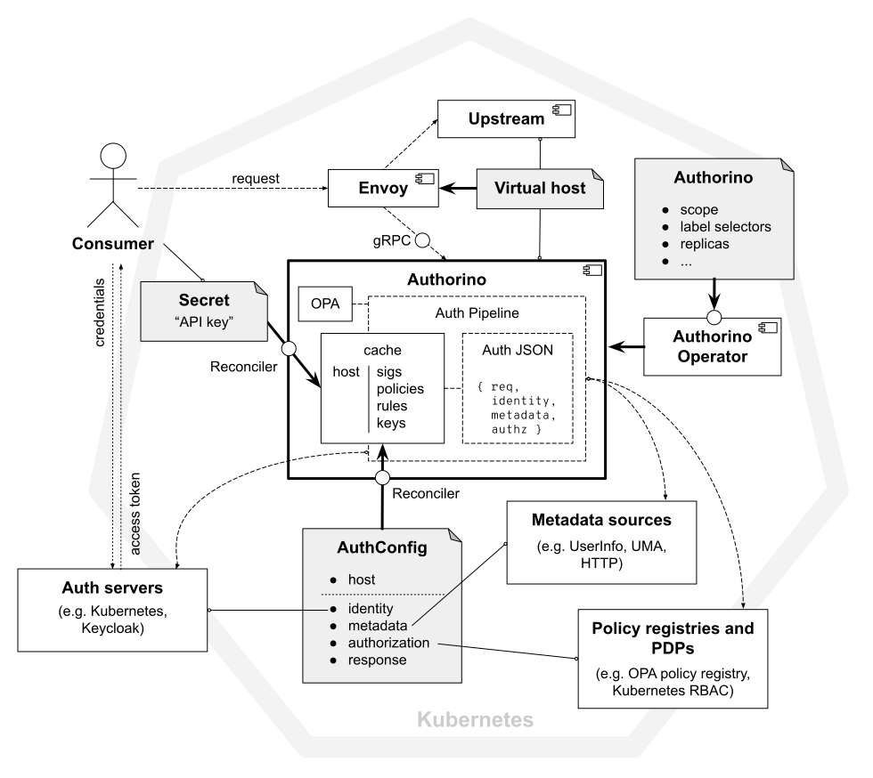

# Architecture
- [Overview](#overview)
- [Topologies](#topologies)
  - [Centralized gateway](#centralized-gateway)
  - [Centralized authorization service](#centralized-authorization-service)
  - [Sidecars](#sidecars)
- [Cluster-wide vs. Namespaced instances](#cluster-wide-vs-namespaced-instances)
- [The Authorino `AuthConfig` Custom Resource Definition (CRD)](#the-authorino-authconfig-custom-resource-definition-crd)
- [Resource reconciliation and status update](#resource-reconciliation-and-status-update)
- [The "Auth Pipeline" (_aka:_ enforcing protection in request-time)](#the-auth-pipeline-aka-enforcing-protection-in-request-time)
- [Host lookup](#host-lookup)
- [The Authorization JSON](#the-authorization-json)
- [Caching](#caching)
  - [OpenID Connect and User-Managed Access configs](#openid-connect-and-user-managed-access-configs)
  - [JSON Web Keys (JWKs) and JSON Web Ket Sets (JWKS)](#json-web-keys-jwks-and-json-web-ket-sets-jwks)
  - [Revoked access tokens](#revoked-access-tokens)
  - [External metadata](#external-metadata)
  - [Compiled Rego policies](#compiled-rego-policies)
  - [Repeated requests](#repeated-requests)
- [Sharding](#sharding)

## Overview



There are a few concepts to understand Authorino's architecture. The main components are: **Authorino**, **Envoy** and the **Upstream** service to be protected. Envoy proxies requests to the the configured **virtual host** upstream service, first contacting with Authorino to decide on authN/authZ.

The topology can vary from centralized proxy and centralized authorization service, to dedicated sidecars, with the nuances in between. Read more about the topologies in the [Topologies](#topologies) section below.

Authorino is deployed using the [**Authorino Operator**](https://github.com/kuadrant/authorino-operator), from an [**`Authorino`**](https://github.com/Kuadrant/authorino-operator/blob/main/config/crd/bases/operator.authorino.kuadrant.io_authorinos.yaml) Kubernetes custom resource. Then, from another kind of custom resource, the **[`AuthConfig`](#the-authorino-authconfig-custom-resource-definition-crd)** CRs, each Authorino instance reads and adds to **cache** the exact rules of authN/authZ to enforce for each protected host ("cache reconciliation").

Everything that the AuthConfig **reconciler** can fetch in reconciliation-time is stored in the cache. This is the case of static parameters such as signing keys, authentication secrets and authorization policies from external **policy registries**.

`AuthConfig`s can refer to identity providers (IdP) and trusted **auth servers** whose access tokens will be accepted to authenticate to the protected host. **Consumers** obtain an authentication token (short-lived access token or long-lived **API key**) and send those in the requests to the protected service.

When Authorino is triggered by Envoy via the **gRPC** interface, it starts evaluating the [**Auth Pipeline**](#the-auth-pipeline-aka-enforcing-protection-in-request-time), i.e. it applies to the request the parameters to verify the identity and to enforce authorization, as found in the cache for the requested host (See [host lookup](#host-lookup) for details).

Apart from static rules, these parameters can include instructions to contact online with external identity verifiers, external sources of **metadata** and policy decision points (**PDPs**).

On every request, Authorino's "working memory" is called [**Authorization JSON**](#the-authorization-json), a data structure that holds information about the context (the HTTP request) and objects from each phase of the auth pipeline: i.e., identity verification (phase i), ad-hoc metadata fetching (phase ii), authorization policy enforcement (phase iii) and dynamic response (phase iv). The evaluators in each of these phases can both read and write from the Authorization JSON for dynamic steps and decisions of authN/authZ.

## Topologies

Typically, upstream APIs are deployed to the same Kubernetes cluster and namespace where the Envoy proxy and Authorino is running (although not necessarily). Whatever is the case, Envoy must be proxying to the upstream API (see Envoy's [HTTP route components](https://www.envoyproxy.io/docs/envoy/latest/api-v3/config/route/v3/route_components.proto) and virtual hosts) and pointing to Authorino in the external authorization filter.

This can be achieved with different topologies:
- Envoy can be a [centralized gateway](#centralized-gateway) with one dedicated instance of Authorino, proxying to one or more upstream services
- Envoy can be deployed as a sidecar of each protected service, but still contacting from a [centralized Authorino authorization service](#centralized-authorization-service)
- Both Envoy and Authorino deployed as [sidecars](#sidecars) of the protected service, restricting all communication between them to localhost

Each topology above induces different measures for security.

### Centralized gateway


Recommended in the protected services to validate the origin of the traffic. It must have been proxied by Envoy. See Authorino [JSON injection](./features.md#json-injection-responsejson) for an extra validation option using a shared secret passed in HTTP header.

### Centralized authorization service


Protected service should only listen on `localhost` and all traffic can be considered safe.

### Sidecars


Recommended [`namespaced` instances of Authorino](#cluster-wide-vs-namespaced-instances) with [fine-grained label selectors](#sharding) to avoid unnecessary caching of `AuthConfig`s.

Apart from that, protected service should only listen on `localhost` and all traffic can be considered safe.

## Cluster-wide vs. Namespaced instances

Auhorino instances can run in either **cluster-wide** or **namespaced** mode.

Namespace-scoped instances only watch resources (`AuthConfig`s and `Secret`s) created in a given namespace. This deployment mode does not require admin privileges over the Kubernetes cluster to deploy the instance of the service (given Authorino's CRDs have been installed beforehand, such as when Authorino is installed using the [Authorino Operator](https://github.com/kuadrant-authorino-operator)).

Cluster-wide deployment mode, in contraposition, deploys instances of Authorino that watch resources across the entire cluster, consolidating all resources into a multi-namespace cache of auth configs. Admin privileges over the Kubernetes cluster is required to deploy Authorino in cluster-wide mode.

Be careful to avoid superposition when combining multiple Authorino instances and instance modes in the same Kubernetes cluster. Apart from caching unnecessary auth config data in the instances depending on your routing settings, the leaders of each instance (set of replicas) may compete for updating the status of the custom resources that are reconciled. See [Resource reconciliation and status update](#resource-reconciliation-and-status-update) for more information.

If necessary, use label selectors to narrow down the space of resources watched and reconciled by each Authorino instance. Check out the [Sharding](#sharding) section below for details.

## The Authorino `AuthConfig` Custom Resource Definition (CRD)

The desired protection for a service is declaratively stated by applying an `AuthConfig` [Custom Resource](https://kubernetes.io/docs/concepts/extend-kubernetes/api-extension/custom-resources) to the Kubernetes cluster running Authorino.

An `AuthConfig` resource typically looks like the following:

```yaml
apiVersion: authorino.3scale.net/v1beta1
kind: AuthConfig
metadata:
  name: my-api-protection
spec:
  # List of one or more hostname[:port] entries, lookup keys to find this config in request-time
  # Authorino will try to prevent hostname collision across Kubernetes namespaces by rejecting a hostname already taken.
  hosts:
    - my-api.io # north-south traffic
    - my-api.ns.svc.cluster.local # east-west traffic

  # List of one or more trusted sources of identity:
  # - Endpoints of issuers of OpenId Connect ID tokens (JWTs)
  # - Endpoints for OAuth 2.0 token introspection
  # - Attributes for the Kubernetes `TokenReview` API
  # - Label selectors for API keys (stored in Kubernetes `Secret`s)
  # - mTLS trusted certificate issuers
  # - HMAC secrets
  identity: […]

  # List of sources of external metadata for the authorization (optional):
  # - Endpoints for HTTP GET or GET-by-POST requests
  # - OIDC UserInfo endpoints (associated with an OIDC token issuer)
  # - User-Managed Access (UMA) resource registries
  metadata: […]

  # List of authorization policies to be enforced (optional):
  # - JSON pattern-matching rules (e.g. `context.request.http.path eq '/pets'`)
  # - Open Policy Agent (OPA) inline or external Rego policies
  # - Attributes for the Kubernetes `SubjectAccessReview` API
  authorization: […]

  # List of dynamic response elements, to inject post-external authorization data into the request (optional):
  # - JSON objects
  # - Festival Wristbands (signed JWTs issued by Authorino)
  # - Envoy Dynamic Metadata
  response: […]

  # Custom HTTP status code, message and headers to replace the default `401 Unauthorized` and `403 Forbidden` (optional)
  denyWith:
    unauthenticated:
      code: 302
      message: Redirecting to login
      headers:
        - name: Location
          value: https://my-app.io/login
    unauthorized: {…}
```

Check out the [OAS](/install/crd/authorino.3scale.net_authconfigs.yaml) of the `AuthConfig` CRD for a formal specification of the options for `identity` verification, external `metadata` fetching, `authorization` policies, and dynamic `response`, as well as any other host protection capability implemented by Authorino.

You can also read the specification from the CLI using the [`kubectl explain`](https://kubernetes.io/docs/reference/generated/kubectl/kubectl-commands#explain) command. The Authorino CRD is required to have been installed in Kubernetes cluster. E.g. `kubectl explain authconfigs.spec.identity.extendedProperties`.

A complete description of supported features and corresponding configuration options within an `AuthConfig` CR can be found in the [Features](./features.md) page.

More concrete examples of `AuthConfig`s for specific use-cases can be found in the [User guides](./user-guides.md).

## Resource reconciliation and status update

[TODO: Explain aboout reconciliation of `AuthConfig`s and `Secret`s, Auhorino cache, leader election, resource status update, etc]

## The "Auth Pipeline" (_aka:_ enforcing protection in request-time)


In each request to the protected API, Authorino triggers the so-called "Auth Pipeline", a set of configured *evaluators* that are organized in a 4-phase pipeline:

- **(i) Identity phase:** at least one source of identity (i.e., one identity evaluator) must resolve the supplied credential in the request into a valid identity or Authorino will otherwise reject the request as unauthenticated (401 HTTP response status).
- **(ii) Metadata phase:** optional fetching of additional data from external sources, to add up to context and identity information, and used in authorization policies and dynamic responses (phases iii and iv).
- **(iii) Authorization phase:** all unskipped policies must evaluate to a positive result ("authorized"), or Authorino will otherwise reject the request as unauthorized (403 HTTP response code).
- **(iv) Response phase** – Authorino builds all user-defined response items (dynamic JSON objects and/or _Festival Wristband_ OIDC tokens), which are supplied back to the external authorization client within added HTTP headers or as Envoy Dynamic Metadata

Each phase is sequential to the other, from (i) to (iv), while the evaluators within each phase are triggered concurrently or as prioritized. The **Identity** phase (i) is the only one required to list at least one evaluator (i.e. one identity source or more); **Metadata**, **Authorization** and **Response** phases can have any number of evaluators (including zero, and even be omitted in this case).

## Host lookup

[TODO: Explain about how host lookup works in Authorino]

## The Authorization JSON

On every Auth Pipeline, Authorino builds the **Authorization JSON**, a "working-memory" data structure composed of `context` (information about the request, as supplied by the Envoy proxy to Authorino) and `auth` (objects resolved in phases (i), (ii) and (iii) of the pipeline). The evaluators of each phase can read from the Authorization JSON and implement dynamic properties and decisions based on its values.

At phase (iii), the authorization evaluators count on an Auhtorization JSON payload that looks like the following:

```jsonc
// The authorization JSON combined along Authorino's auth pipeline for each request
{
  "context": { // the input from the proxy
    "origin": {…},
    "request": {
      "http": {
        "method": "…",
        "headers": {…},
        "path": "/…",
        "host": "…",
        …
      }
    }
  },
  "auth": {
    "identity": {
      // the identity resolved, from the supplied credentials, by one of the evaluators of phase (i)
    },
    "metadata": {
      // each metadata object/collection resolved by the evaluators of phase (ii), by name of the evaluator
    }
  }
}
```

The policies evaluated can use any data from the authorization JSON to define authorization rules.

After phase (iii), Authorino appends to the authorization JSON the results of this phase as well, and the payload available for phase (iv) becomes:

```jsonc
// The authorization JSON combined along Authorino's auth pipeline for each request
{
  "context": { // the input from the proxy
    "origin": {…},
    "request": {
      "http": {
        "method": "…",
        "headers": {…},
        "path": "/…",
        "host": "…",
        …
      }
    }
  },
  "auth": {
    "identity": {
      // the identity resolved, from the supplied credentials, by one of the evaluators of phase (i)
    },
    "metadata": {
      // each metadata object/collection resolved by the evaluators of phase (ii), by name of the evaluator
    },
    "authorization": {
      // each authorization policy result resolved by the evaluators of phase (iii), by name of the evaluator
    }
  }
}
```

[Festival Wristbands](#festival-wristbands) and [Dynamic JSON](#dynamic-json-response) responses can include dynamic values (custom claims/properties) fetched from the authorization JSON. These can be returned to the external authorization client in added HTTP headers or as Envoy [Well Known Dynamic Metadata](https://www.envoyproxy.io/docs/envoy/latest/configuration/advanced/well_known_dynamic_metadata). Check out [Dynamic response features](./features.md#dynamic-response-features-response) for details.

For information about reading and fetching data from the Authorization JSON (syntax, functions, etc), check out [JSON paths](./features.md#common-feature-json-paths-valuefromauthjson).

## Caching

### OpenID Connect and User-Managed Access configs

OpenID Connect and User-Managed Access configurations discovered in reconciliation-time.

### JSON Web Keys (JWKs) and JSON Web Ket Sets (JWKS)

JSON signature verification certificates discovered usually in reconciliation-time, following an OIDC discovery associated to an identity source.

### Revoked access tokens

<table>
  <tr>
    <td><small>Not implemented - In analysis (<a href="https://github.com/kuadrant/authorino/issues/19">#19</a>)</small></td>
  </tr>
</table>

Caching of access tokens identified and or notified as revoked prior to expiration.

### External metadata

<table>
  <tr>
    <td><small>Not implemented - Planned (<a href="https://github.com/kuadrant/authorino/issues/21">#21</a>)</small></td>
  </tr>
</table>

Caching of resource data obtained in previous requests.

### Compiled Rego policies

Performed automatically by Authorino in reconciliation-time for the authorization policies based on the built-in OPA module.

### Repeated requests

<table>
  <tr>
    <td><small>Not implemented - In analysis (<a href="https://github.com/kuadrant/authorino/issues/20">#20</a>)</small></td>
  </tr>
</table>

For consecutive requests performed, within a given period of time, by a same user that request for a same resource, such that the result of the auth pipeline can be proven that would not change.

## Sharding

Managed instances of Authorino offered to API providers who create and maintain their own API protection states within their own realms and namespaces.

[TODO: explain about `AUTH_CONFIG_LABEL_SELECTOR`]
