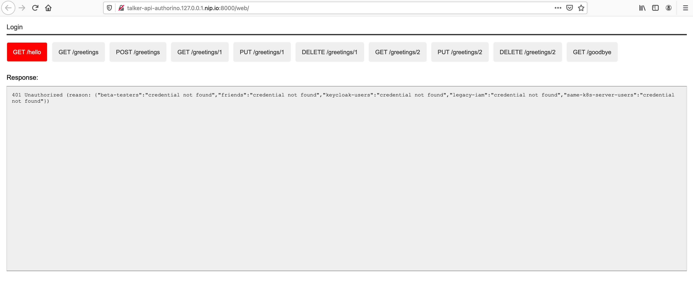
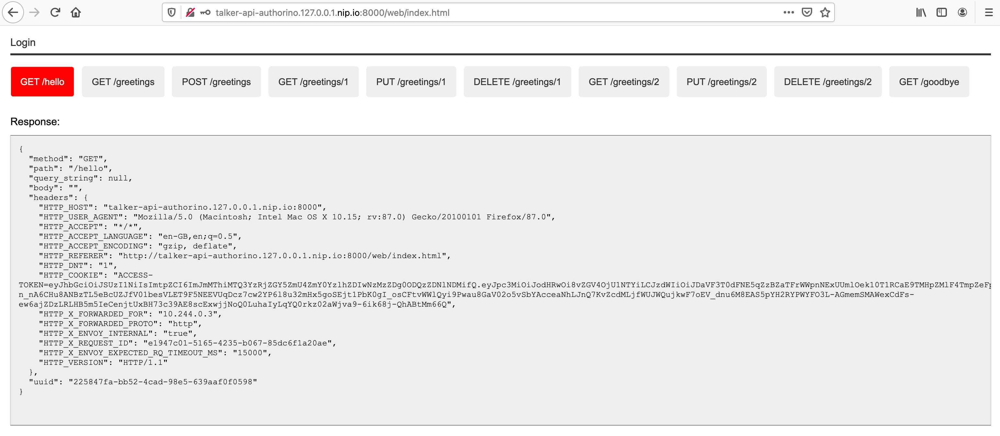

# Tutorial: Authorino Showcase

- [Intro](#intro)
- [Stack](#stack)
- [Clone the repo](#clone-the-repo)
- [Setup the trial local environment](#setup-the-trial-local-environment)
- [Use-case #1: Kubernetes authentication](#use-case-1-kubernetes-authentication)
- [Use-case #2: API key authentication](#use-case-2-api-key-authentication)
- [Use-case #3: Friends cannot `DELETE`](#use-case-3-friends-cannot-delete)
- [Use-case #4: Beta-testers](#use-case-4-beta-testers)
- [Use-case #5: OIDC authentication with Keycloak](#use-case-5-oidc-authentication-with-keycloak)
- [Use-case #6: Only admins can say `/hello`](#use-case-6-only-admins-can-say-hello)
- [Use-case #7: Keycloak users can only modify their own resources](#use-case-7-keycloak-users-can-only-modify-their-own-resources)
- [Use-case #8: Webapp users authenticated with Dex IdP](#use-case-8-webapp-users-authenticated-with-dex-idp)
- [Cleanup](#cleanup)

## Intro

This tutorial will walk you through the steps of using Authorino and the Envoy proxy to protect an example API, on a Kubernetes cluster, for 8 consecutive sample use cases.

Each sample use case is built on top of the previous one, as a series of consecutive improvements that either expand access to the API to different groups of users or restrict the API based on attributes of the user (UBAC), roles (RBAC), context (ABAC) or requested resource (resource-level AC).

In the end, you will have protected the API starting from a simple use case of authentication with Kubernetes auth tokens, up to a complex deployment of multiple sources of identity and combination of various authorization policies.

The following Authorino features are covered in this tutorial:
- Kubernetes auth
- API key auth
- OpenID Connect JWT validation
- User-Managed Access (UMA)-based attribute data
- JSON authorization policies
- Open Policy Agent (OPA) inline Rego policies

## Stack

The stack of applications involved in this tutorial was thought to be deployed on a sample Kubernetes cluster, deployed locally using [Kind](https://kind.sigs.k8s.io), and with resources hosted with the Authorino's code base. For more information, see [Deploy Authorino with a local cluster](/docs/deploy.md#option-a-local-cluster), and the Authorino [examples](/examples) page.

On top of this platform, the following applications compose the stack for this tutorial:

- **Talker API**<br/>
    Just a simple rack application that echoes back in a JSON whatever it gets in the request.
- **Envoy proxy**<br/>
    Serving the Talker API, configured with the ext_authz http filter pointing to Authorino.
- **Authorino**<br/>
    The AuthN/AuthZ enforcer that will watch and apply Authorino `AuthConfig` custom resources in the Kubernetes/OpenShift server.
- **Keycloak**<br/>
    To issue OIDC access tokens and to provide ad hoc resource data for the authorization payload. The server is bundled with the following preloaded settings and realm resources:
    - Admin console: http://localhost:8080/auth/admin (admin/p)
    - Preloaded realm: **kuadrant**
    - Preloaded clients:
      - **demo**: to which API consumers delegate access and therefore the one which access tokens are issued to
      - **authorino**: used by Authorino to fetch additional user info with client_credentials grant type
      - **talker-api**: used by Authorino to fetch UMA-protected resource data associated with the Talker API
    - Preloaded resources:
      - `/hello`
      - `/greetings/1` (owned by user john)
      - `/greetings/2` (owned by user jane)
      - `/goodbye`
    - Realm roles:
      - member (default to all users)
      - admin
    - Preloaded users:
      - john/p (member)
      - jane/p (admin)
      - peter/p (member; email not verified)
- **Dex**<br/>
    IdP to issue OIDC access tokens for the webapp.
    - Preloaded client: **talker-web**: to get access to the Talker API via webapp
    - Preloaded user: marta@localhost/p
- **Talker Web**<br/>
    Webapp to consume resources of the Talker API from a web browser
    - URL: http://talker-api-authorino.127.0.0.1.nip.io:8000/web

## Clone the repo

```sh
$ git clone git@github.com:kuadrant/authorino.git && cd authorino
```

## Setup the trial local environment

Launch the Kubernetes cluster on a Docker with [Kind](https://kind.sigs.k8s.io) and deploy the main applications of the stack. This step may take up to a few minutes for the cluster and all the deployments to be ready.

```sh
$ make local-setup SKIP_LOCAL_BUILD=1 DEPLOY_IDPS=1
```

Forward requests from the local host machine to pods running inside the cluster (API, Keycloak server, and Dex server):

```sh
$ kubectl -n authorino port-forward deployment/envoy 8000:8000 &
$ kubectl -n authorino port-forward deployment/keycloak 8080:8080 &
$ kubectl -n authorino port-forward deployment/dex 5556:5556 &
```

Add the `keycloak` host name to your DNS resolution chain, so token requests initiated outside the cluster can have the issuer validated by Keycloak:

```sh
$ echo '127.0.0.1 keycloak'>>/etc/hosts
```

## Use-case #1: Kubernetes authentication

In this base use case, we want to give access to our protected API (the “Talker API”) to known users of the same Kubernetes server where both the API and Authorino are running. This is a good use for Authorino's **Kubernetes authentication** feature.

The protection to the API defines an identity group 'same-k8s-server-users', whose users will have full access to the API.

Apply the CR:

```sh
$ kubectl -n authorino apply -f docs/tutorials/showcase/showcase-api-protection-1.yaml
```

Create a Service Account with permission to issue Kubernetes tokens:

```sh
$ kubectl -n authorino apply -f - <<EOF
apiVersion: v1
kind: ServiceAccount
metadata:
  name: sa-token-issuer
EOF

$ kubectl -n authorino apply -f - <<EOF
apiVersion: rbac.authorization.k8s.io/v1
kind: ClusterRoleBinding
metadata:
  name: sa-token-issuer
roleRef:
  apiGroup: rbac.authorization.k8s.io
  kind: ClusterRole
  name: cluster-admin
subjects:
- kind: ServiceAccount
  name: sa-token-issuer
  namespace: authorino
EOF
```

Create a Service Account to represent a client consumer of the API:

```sh
$ kubectl -n authorino apply -f - <<EOF
apiVersion: v1
kind: ServiceAccount
metadata:
  name: api-consumer
EOF
```

Request an access token for the API consumer Service Account, with the same audience required to access the protected API.

> **NOTE:** The token issued will be immediately valid and will expire after 10 minutes.

```sh
$ CURRENT_K8S_CONTEXT=$(kubectl config view -o json | jq -r '."current-context"')
$ CURRENT_K8S_CLUSTER=$(kubectl config view -o json | jq -r --arg K8S_CONTEXT "${CURRENT_K8S_CONTEXT}"  '.contexts[] | select(.name == $K8S_CONTEXT) | .context.cluster')
$ export KUBERNETES_API=$(kubectl config view -o json | jq -r --arg K8S_CLUSTER "${CURRENT_K8S_CLUSTER}" '.clusters[] | select(.name == $K8S_CLUSTER) | .cluster.server')
$ export TOKEN_ISSUER_TOKEN=$(kubectl -n authorino get secret/$(kubectl -n authorino get sa/sa-token-issuer -o json | jq -r '.secrets[0].name') -o json | jq -r '.data.token' | base64 -d)

$ export ACCESS_TOKEN=$(curl -k -X "POST" "$KUBERNETES_API/api/v1/namespaces/authorino/serviceaccounts/api-consumer/token" \
     -H "Authorization: Bearer $TOKEN_ISSUER_TOKEN" \
     -H 'Content-Type: application/json; charset=utf-8' \
     -d $'{ "apiVersion": "authentication.k8s.io/v1", "kind": "TokenRequest", "spec": { "audiences": ["talker"], "expirationSeconds": 600 } }' | jq -r '.status.token')
```

Send requests to the API:

```sh
$ curl -H "Authorization: Bearer $ACCESS_TOKEN" http://talker-api-authorino.127.0.0.1.nip.io:8000/hello
200 OK
```

## Use-case #2: API key authentication

In this step, we want to expand access to the Talker API to some friends who are not users of the Kubernetes cluster. Therefore, we will extend the definition of protection of the API with a second identity source, based on Authorino's **API key authentication** feature.

Apply the CR:

```sh
$ kubectl -n authorino apply -f docs/tutorials/showcase/showcase-api-protection-2.yaml
```

Create a secret holding an API key to access the API, and with labels matching the label selectors specified in the CR for the identity source 'friends':

```sh
$ kubectl -n authorino apply -f - <<EOF
apiVersion: v1
kind: Secret
metadata:
  name: friend-1-api-key-1
  labels:
    authorino.3scale.net/managed-by: authorino
    custom-label: friends
stringData:
  api_key: $(openssl rand -hex 32)
type: Opaque
EOF

$ export API_KEY=$(kubectl -n authorino get secret/friend-1-api-key-1 -o json | jq -r '.data.api_key' | base64 -d)
```

Send requests to the API:

```sh
$ curl -H "Authorization: Bearer $API_KEY" http://talker-api-authorino.127.0.0.1.nip.io:8000/greetings/1
200 OK
```

## Use-case #3: Friends cannot `DELETE`

Let us now forbid `DELETE` requests to the users of the second source of identities added in the previous use case (the 'friends' identity source). We will leverage Authorino's **JSON pattern matching authorization** policies for this.

Apply the CR:

```sh
$ kubectl -n authorino apply -f docs/tutorials/showcase/showcase-api-protection-3.yaml
```

Send requests to the API:

```sh
$ curl -H "Authorization: Bearer $API_KEY" -X DELETE http://talker-api-authorino.127.0.0.1.nip.io:8000/greetings/1
403 Forbidden
```

## Use-case #4: Beta-testers

In order to grant temporary access to beta testers of the Talker API, we will once again use use Authorino API key authentication, but for this use case combined with Authorino's **Open Policy Agent (OPA) inline Rego authorization** policies.

The policy for the short-lived API keys held by users of this groups will accept any API key created within the last 5 days. After this time span, the API key must no longer be valid, regardless of if the Kubernetes secret has been deleted or not. Requests to the API with this API key shall then be denied.

If you prefer, you can edit the 'short-lived-api-keys-for-beta-testers' authorization policy in the CR file, setting a different time span for the API key, thus allowing you to try this use case before and after the API key expires, without having to wait 5 days in between.

Apply the CR:

```sh
$ kubectl -n authorino apply -f docs/tutorials/showcase/showcase-api-protection-4.yaml
```

Create a secret holding an API key for a beta tester user to access the API:

```sh
$ kubectl -n authorino apply -f - <<EOF
apiVersion: v1
kind: Secret
metadata:
  name: beta-tester-1-api-key-1
  labels:
    authorino.3scale.net/managed-by: authorino
    group: beta-testers
stringData:
  api_key: $(openssl rand -hex 32)
type: Opaque
EOF

$ export API_KEY=$(kubectl -n authorino get secret/beta-tester-1-api-key-1 -o json | jq -r '.data.api_key' | base64 -d)
```

Send requests to the API:

```sh
$ curl -H "Authorization: Bearer $API_KEY" http://talker-api-authorino.127.0.0.1.nip.io:8000/greetings/1
200 OK
```

After the short-lived API key expires:

```sh
$ curl -H "Authorization: Bearer $API_KEY" http://talker-api-authorino.127.0.0.1.nip.io:8000/greetings/1
403 Forbidden
```

## Use-case #5: OIDC authentication with Keycloak

It is time to open the Talker API to users from other identity providers (IdPs), managed by a more robust identity and access managament (IAM) system. For this, we will connect a Keycloak server to the protection of the API. Users will be authenticated by Keycloak via **OpenID Connect**. Authorino will discover the OpenID Connect configuration, so the ID tokens (JWTs) issued by the Keycloak server (directly to the users) can be verified and validated by Authorino on every request to the protected API.

Apply the CR:

```sh
$ kubectl -n authorino apply -f docs/tutorials/showcase/showcase-api-protection-5.yaml
```

Get an access token issued by the Keycloak server to a user of the 'kuadrant' realm:

```sh
$ export ACCESS_TOKEN=$(curl -d 'grant_type=password' -d 'client_id=demo' -d 'username=john' -d 'password=p' "http://keycloak:8080/auth/realms/kuadrant/protocol/openid-connect/token" | jq -r '.access_token')
```

Send requests to the API:

```sh
$ curl -H "Authorization: Bearer $ACCESS_TOKEN" http://talker-api-authorino.127.0.0.1.nip.io:8000/greetings
200 OK
```

## Use-case #6: Only admins can say `/hello`

The JSON Web Tokens (JWT) issued by the Keycloak server include a claim about the realm roles associated to the identity. We want to use that information to limit access to the `/hello` endpoint of the Talker API only to 'admin' users of the Keycloak realm added to the auth stack in the previous use case. This is again a good use case for Authorino's **JSON pattern matching authorization** policies.

Apply the CR:

```sh
$ kubectl -n authorino apply -f docs/tutorials/showcase/showcase-api-protection-6.yaml
```

Get an access token issued by the Keycloak server to the user John, who is not part of the 'admin' group in the Keycloak realm and therefore cannot access the `/hello` endpoint of the Talker API:

```sh
$ export ACCESS_TOKEN_JOHN=$(curl -d 'grant_type=password' -d 'client_id=demo' -d 'username=john' -d 'password=p' "http://keycloak:8080/auth/realms/kuadrant/protocol/openid-connect/token" | jq -r '.access_token')
```

Consume the API as John:

```sh
$ curl -H "Authorization: Bearer $ACCESS_TOKEN_JOHN" http://talker-api-authorino.127.0.0.1.nip.io:8000/hello
403 Forbidden

$ curl -H "Authorization: Bearer $ACCESS_TOKEN_JOHN" http://talker-api-authorino.127.0.0.1.nip.io:8000/greetings
200 OK
```

Get an access token issued by the Keycloak server to the user Jane, who is part of the 'admin' group in the Keycloak realm and therefore can access the `/hello` endpoint of the Talker API:

```sh
$ export ACCESS_TOKEN_JANE=$(curl -d 'grant_type=password' -d 'client_id=demo' -d 'username=jane' -d 'password=p' "http://keycloak:8080/auth/realms/kuadrant/protocol/openid-connect/token" | jq -r '.access_token')
```

Consume the API as Jane:

```sh
$ curl -H "Authorization: Bearer $ACCESS_TOKEN_JANE" http://talker-api-authorino.127.0.0.1.nip.io:8000/hello
200 OK

$ curl -H "Authorization: Bearer $ACCESS_TOKEN_JANE" http://talker-api-authorino.127.0.0.1.nip.io:8000/greetings
200 OK
```

## Use-case #7: Keycloak users can only modify their own resources

In this use case, we will add an authorization policy that matches information about the user's identity (present in the OpenID Connect JWT issued by Keycloak) with information about the requested resource. We will configure Authorino to fetch additional metadata from a **User-Managed Access (UMA)** source of attribute data (the Keycloak server as well), and, for every `PUT` request sent to `/greetings/{id}` by a user authenticated with Keycloak, an inline OPA Rego policy will grant/deny access depending on if the `owner` claim associated with the requested resource matches/does not match the `sub` claim of the supplied JWT.

Apply the CR:

```sh
$ kubectl -n authorino apply -f docs/tutorials/showcase/showcase-api-protection-7.yaml
```

Get an access token issued by the Keycloak server to the user John, who owns the resource `/greetings/1` of the Talker API in the Keycloak realm, and therefore can only send `PUT` requests to this resource:

```sh
$ export ACCESS_TOKEN_JOHN=$(curl -d 'grant_type=password' -d 'client_id=demo' -d 'username=john' -d 'password=p' "http://keycloak:8080/auth/realms/kuadrant/protocol/openid-connect/token" | jq -r '.access_token')
```

Consume the API as John:

```sh
$ curl -H "Authorization: Bearer $ACCESS_TOKEN_JOHN" http://talker-api-authorino.127.0.0.1.nip.io:8000/greetings/1
200 OK

$ curl -H "Authorization: Bearer $ACCESS_TOKEN_JOHN" -X PUT http://talker-api-authorino.127.0.0.1.nip.io:8000/greetings/1
200 OK

$ curl -H "Authorization: Bearer $ACCESS_TOKEN_JOHN" -X PUT http://talker-api-authorino.127.0.0.1.nip.io:8000/greetings/2
403 Forbidden
```

Get an access token issued by the Keycloak server to the user Jane, who owns the resource `/greetings/2` of the Talker API in the Keycloak realm, and therefore can only send `PUT` requests to this resource:

```sh
$ export ACCESS_TOKEN_JANE=$(curl -d 'grant_type=password' -d 'client_id=demo' -d 'username=jane' -d 'password=p' "http://keycloak:8080/auth/realms/kuadrant/protocol/openid-connect/token" | jq -r '.access_token')
```

Consume the API as Jane:

```sh
$ curl -H "Authorization: Bearer $ACCESS_TOKEN_JANE" http://talker-api-authorino.127.0.0.1.nip.io:8000/greetings/1
200 OK

$ curl -H "Authorization: Bearer $ACCESS_TOKEN_JANE" -X PUT http://talker-api-authorino.127.0.0.1.nip.io:8000/greetings/1
403 Forbidden

$ curl -H "Authorization: Bearer $ACCESS_TOKEN_JANE" -X PUT http://talker-api-authorino.127.0.0.1.nip.io:8000/greetings/2
200 OK
```

## Use-case #8: Webapp users authenticated with Dex IdP

In this final use case, we want to integrate another source of identities, a Dex IdP server, representing in our example a legacy source of identity, whose users shall have full access to the Talker API through a web application. The webapp will send requests via JavaScript directly to the protected API. The OpenID Connect tokens issued by the Dex server must travel in a cookie instead of the typical HTTP `Authorization` header.

Deploy the web application to the Kubernetes server:

```sh
$ kubectl -n authorino apply -f ./examples/talker-web/talker-web-deploy.yaml
```

The web application will be served by the same Envoy proxy serving the Talker API, under the same domain name. This is only for simplicify and to avoid further configuration related to the CORS policy enforced by the web browser.

Apply the CR:

```sh
$ kubectl -n authorino apply -f docs/tutorials/showcase/showcase-api-protection-8.yaml
```

Access the webapp in the web browser at http://talker-api-authorino.127.0.0.1.nip.io:8000/web.

Click on the menu buttons to access the resources of the protected API. Verify that access is denied due to missing authentication.



Click on "Login" to authenticate, entering the credentials below in the Dex provided login page, and then granting access to the client.
- **username:** marta@localhost
- **password:** password

The access token will be stored by the web application in a cookie and travel to the protected API in every request sent by the webapp via JavaScript.

Click again on the menu buttons to consume resources of the API. Verify that now access is granted.



## Cleanup

Delete the Kubernetes cluster:

```sh
$ make local-cleanup
```

Remove the entry added to your `/etc/hosts` file to resolve the `keycloak` host name locally.
