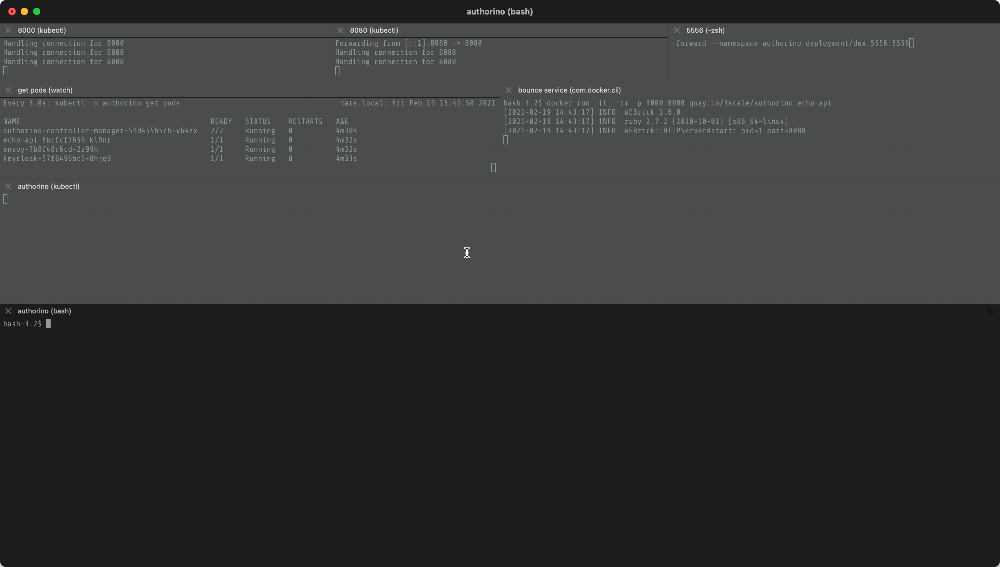
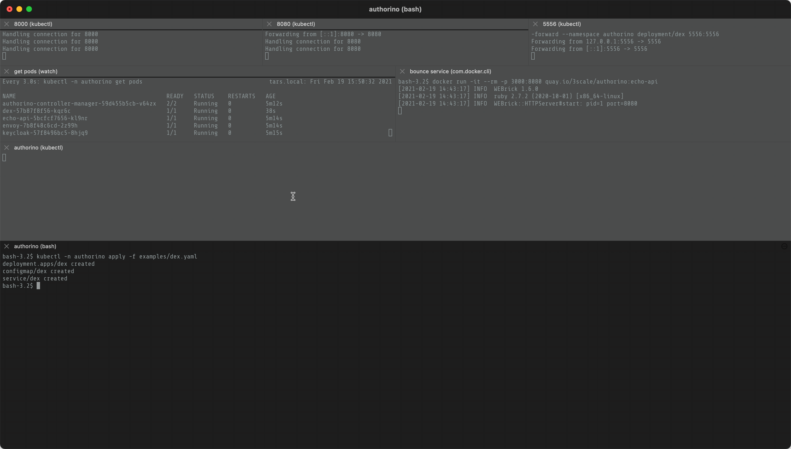

# Try Authorino with [dex](https://dexidp.io)

The instructions here are based on the Authorino's [Try it out](README.md#try-it-out-with-the-example) example, which already deploys a Kubernetes local environment containing:
- an example API (the Echo API)
- the Envoy proxy
- a pre-configured instance of Keycloak, and
- Authorino

We will then add [dex](https://dexidp.io) as additional (yet independent) identity source on top of this stack.

| Add dex to the server             | Add dex to the auth pipeline         | Get an access token and start sending requests |
|-----------------------------------|--------------------------------------|--------------------------------------|
|  |   |     |

### 1. Start with the original _Try it out_ example

Here is a summary of the steps to launch the environment:

```shell
# clone the repo
git clone git@github.com:3scale-labs/authorino.git && cd authorino

# start the environment
make local-setup

# expose the services to the local host
kubectl -n authorino port-forward deployment/envoy 8000:8000 &
kubectl -n authorino port-forward deployment/keycloak 8080:8080 &

# create a required secret
kubectl -n authorino create secret generic umacredentialssecret \
        --from-literal=clientID=echo-api \
        --from-literal=clientSecret='523b92b6-625d-4e1e-a313-77e7a8ae4e88'

# add protection to the echo api with Authorino
kubectl -n authorino apply -f ./examples/echo-api-protection.yaml
```

### 2. Add dex

Add dex to the cluster:
```shell
kubectl -n authorino apply -f examples/dex.yaml
```

Expose the dex service port to the local host:
```shell
kubectl -n authorino port-forward deployment/dex 5556:5556 &
```

Update the Echo API auth service so dex can be used as additional identity source:
```shell
kubectl -n authorino patch services.config.authorino.3scale.net/echo-api --type=json -p '
[
  {
    "op": "add",
    "path": "/spec/identity/-",
    "value": {
      "name": "dex",
      "oidc": {
        "endpoint": "http://dex:5556"
      },
      "credentials": {
        "in": "authorization_header",
        "keySelector": "Bearer"
      }
    }
  },
  {
    "op": "add",
    "path": "/spec/metadata/-",
    "value": {
      "name": "userinfo",
      "userInfo": {
        "identitySource": "dex"
      }
    }
  }
]'
```

The above will add dex as alternative identity source without removing Keycloak. This means that clients authenticated by either of these IAMs will be able to send requests to the Echo API. This is super cool! If you still prefer removing Keycloak altogether though, keeping only dex, it should be just as simple. We'll leave that as an exercise :-)

The patch also adds a second OAuth2 UserInfo metadata source. We chose to name the pre-existing one (pointing to Keycloak) and the new one (pointing to dex) both "userinfo". This is a trick that will make either one of the sources that evaluates to a non-null metadata value to replace the other in the JSON input for the OPA authorization policy evaluator triggered after. You could just as well of course name the Keycloak-fetched UserInfo and the dex-fetched one distinguishbly, and then refer to these metadata values in your authorization policies as such.

After patching the auth service config, the Authorino Kubernetes controller will automatically reconcile and make sure the Echo API is ready to be consumed under the new auth configs, without requiring redeploying any component.

### 3. (Optional) Start a bounce service locally to help you complete the OAuth code flow with dex

Dex is pre-configured to accept by default only OAuth 2 [Authorization Code Grant](https://tools.ietf.org/html/rfc6749#section-1.3.1) flow. Therefore you will need a way to receive the code to be exchanged for an actual access token. We can use the same Echo API from the example as a bounce service to retrieve the authorization code.

```shell
docker run -it --rm -p 3000:8080 quay.io/3scale/authorino:echo-api
```

### 4. Get an access token

On a web browser, go to http://localhost:5556/auth?scope=openid%20profile%20email&response_type=code&client_id=authorino&redirect_uri=http://localhost:3000/callback.

> _Tip:_ Set your local DNS to resolve the domain name `dex` to `127.0.0.1` to avoid dex's login page from failing to download assets (JavaScript and CSS files) due to the Content Security Policy (CSP) enforced by the browser. This step is optional.

Log in with the following credentials:
- **Username:** admin@localhost
- **Password:** password

Grant access to the scopes in the next page.

After the login is successful, copy for the value of the `code` query string parameter from the URL of the page. You can also find this value in the logs of the bounce service launched in the previous step.

Now exchange the authorization code for an access token by running the command below. Do not forget to replace the placeholder `<authorization-code>` with the code copied.

```shell
export ACCESS_TOKEN=$(curl -k -d 'grant_type=authorization_code' -d 'code=<authorization-code>' -d 'client_id=authorino' -d 'client_secret=aaf88e0e-d41d-4325-a068-57c4b0d61d8e' -d 'redirect_uri=http://localhost:3000/callback' "http://localhost:5556/token" | jq -r '.id_token')
```

### 5. Send requests to the Echo API

```shell
curl -H 'Host: echo-api' -H "Authorization: Bearer $ACCESS_TOKEN" http://localhost:8000/hello -v             # 200 OK
curl -H 'Host: echo-api' -H "Authorization: Bearer $ACCESS_TOKEN" http://localhost:8000/greetings/1 -v       # 403 Forbidden
curl -H 'Host: echo-api' -H "Authorization: Bearer $ACCESS_TOKEN" http://localhost:8000/bye -v               # 403 Forbidden
```

> _Bonus tip:_ If you didn't remove Keycloak, you can still send requests using Keycloak-issued access tokens:

```shell
# User: John (member)
export ACCESS_TOKEN_JOHN=$(curl -k -d 'grant_type=password' -d 'client_id=demo' -d 'username=john' -d 'password=p' "http://localhost:8080/auth/realms/ostia/protocol/openid-connect/token" | jq -r '.access_token')

curl -H 'Host: echo-api' -H "Authorization: Bearer $ACCESS_TOKEN_JOHN" http://localhost:8000/hello -v        # 200 OK
curl -H 'Host: echo-api' -H "Authorization: Bearer $ACCESS_TOKEN_JOHN" http://localhost:8000/greetings/1 -v  # 200 OK
curl -H 'Host: echo-api' -H "Authorization: Bearer $ACCESS_TOKEN_JOHN" http://localhost:8000/bye -v          # 403 Forbidden

# User: Jane (admin)
export ACCESS_TOKEN_JANE=$(curl -k -d 'grant_type=password' -d 'client_id=demo' -d 'username=jane' -d 'password=p' "http://localhost:8080/auth/realms/ostia/protocol/openid-connect/token" | jq -r '.access_token')

curl -H 'Host: echo-api' -H "Authorization: Bearer $ACCESS_TOKEN_JANE" http://localhost:8000/hello -v        # 200 OK
curl -H 'Host: echo-api' -H "Authorization: Bearer $ACCESS_TOKEN_JANE" http://localhost:8000/greetings/1 -v  # 403 Forbidden
curl -H 'Host: echo-api' -H "Authorization: Bearer $ACCESS_TOKEN_JANE" http://localhost:8000/bye -v          # 200 OK
```
